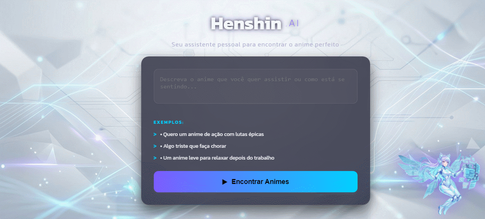

# 🦸‍♂️ Henshin.AI - Inteligência Adaptativa para Animes

O **Henshin.AI** (anteriormente AnimeBot) é um ecossistema **Fullstack** projetado para transformar o humor e a intenção do usuário em recomendações precisas de animes. O nome "Henshin" (Transformação) reflete tanto a cultura dos animes quanto a evolução técnica deste projeto: a transição de uma automação externa para um back-end resiliente e inteligente.

---

## 🔄 A Evolução: Antes vs. Depois

Um dos pontos altos deste projeto foi o processo de **refatoração e amadurecimento visual**. Saí de uma interface simples para um ambiente imersivo e focado em UX.

| Versão Anterior (AnimeBot) | Versão Atual (Henshin.AI) |
| :--- | :--- |
|  |  |
| **Foco:** Automação via n8n e interface básica. | **Foco:** Back-end em Node.js, Design System Moderno e Imersão. |
| **Visual:** Cores sólidas e animações de preenchimento. | **Visual:** Background tecnológico (Cenário), Blur (Glassmorphism) e Títulos em Neon. |

---

## 🌟 Diferencial e Engenharia de Resiliência
O maior desafio superado foi a **fragilidade de entradas de dados**. Automações comuns costumam quebrar com variações de texto ou instabilidade de APIs externas.

**A Solução de Arquitetura:**
- **Engenharia de Prompt:** Utilizo o **Google Gemini** para interpretar a "linguagem natural" do usuário, convertendo sentimentos em parâmetros de busca precisos.
- **Camada de Fallback (Node.js):** Implementei um servidor que atua como escudo. Se a API externa falhar, o **Henshin.AI** consome um catálogo local otimizado (JSON), garantindo 100% de disponibilidade.
- **Design System Moderno:** Interface com contraste de pesos na fonte **Kanit** (800 para o nome e 200 para o .AI) e efeitos de brilho (`text-shadow`) que garantem leitura em qualquer cenário.

---

## 🛠️ Tecnologias de Ponta
- **Front-end:** HTML5, CSS3 (Glassmorphism & Neon Effects), JavaScript Moderno (Manipulação de DOM e Eventos).
- **Back-end:** **Node.js & Express** (Arquitetura de API robusta).
- **IA:** Google Gemini (Análise de Sentimento & Curadoria).
- **Dados:** Jikan API & Banco de Dados Local para redundância.
- **Ferramentas de Gestão:** SQL (DBeaver) para estruturação de dados.

---

## 📂 Estrutura do Ecossistema
- `/src`: Interface visual responsiva e lógica de consumo.
- `/backend/server.js`: O "Cérebro" em Node.js para gerenciamento de dados e resiliência.
- `/backend/dados_animes.json`: Catálogo de segurança (Local Database).
- `package.json`: Configurações de dependências e scripts de automação.

---

## 🚀 Próximos Passos (Roadmap)
- [ ] **Persistência em SQL:** Migrar o catálogo local para um banco de dados relacional.
- [ ] **Sistema de Favoritos:** Criar contas de usuário para salvar recomendações.
- [ ] **Tailwind CSS:** Refatorar o estilo para uma estrutura ainda mais escalável.

---

### 💡 Por que este projeto é único?
Diferente de recomendadores comuns, o **Henshin.AI** foca na experiência humana. Ele entende se você busca relaxar após o trabalho ou se deseja a adrenalina de lutas épicas, tratando cada busca como uma interação emocional única.

---

## 👨‍💻 Como Executar o Projeto

1. **Clone o repositório:**
   ```bash
   git clone [https://github.com/seu-usuario/henshin-ai.git](https://github.com/seu-usuario/henshin-ai.git)

   2. **Inicie o Servidor de Back-end:**
   cd backend
   npm install
   npm start

   *O servidor estará rodando em http://localhost:3001.*
3. **Abra o Front-end:**
   Abra o arquivo index.html usando a extensão Live Server do VS Code ou diretamente no seu navegador preferido.


---