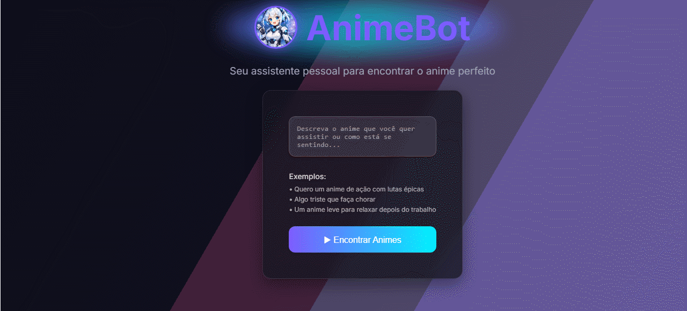

# 🦸‍♂️ Henshin.AI - Inteligência Adaptativa para Animes

O **Henshin.AI** (anteriormente AnimeBot) é um ecossistema **Fullstack** projetado para transformar o humor e a intenção do usuário em recomendações precisas de animes. O nome "Henshin" (Transformação) reflete tanto a cultura dos animes quanto a evolução técnica deste projeto: a transição de uma automação externa para um back-end resiliente e inteligente.

---

## 🌟 Diferencial e Engenharia de Resiliência
O maior desafio superado foi a **fragilidade de entradas de dados**. Automações comuns costumam quebrar com variações de texto ou instabilidade de APIs externas.

**A Solução de Arquitetura:**
- **Engenharia de Prompt:** Utilizo o **Google Gemini** para interpretar a "linguagem natural" do usuário, convertendo sentimentos em parâmetros de busca precisos.
- **Camada de Fallback (Node.js):** Implementei um servidor que atua como escudo. Se a API externa falhar, o **Henshin.AI** consome um catálogo local otimizado, garantindo 100% de disponibilidade.
- **Design System Moderno:** Interface com contraste de pesos na fonte **Kanit** (800 para o nome e 200 para o .AI) e efeitos neon pulsantes que reforçam a identidade futurista.

---

## 🛠️ Tecnologias de Ponta
- **Front-end:** HTML5, CSS3 (Glassmorphism & Neon Effects), JavaScript Moderno.
- **Back-end:** **Node.js & Express** (Arquitetura de API robusta na porta 3001).
- **IA:** Google Gemini (Análise de Sentimento & Curadoria).
- **Dados:** Jikan API & Banco de Dados Local (JSON) para redundância.
- **Lógica de Automação:** n8n (Orquestração original de workflows).

---

## 📂 Estrutura do Ecossistema
- `/src`: Interface visual responsiva e lógica de consumo.
- `/backend/server.js`: O "Cérebro" em Node.js para gerenciamento de dados e resiliência.
- `/backend/dados_animes.json`: Catálogo de segurança (Local Database).
- `package.json`: Configurações de dependências e scripts de automação.

---

## 🛠️ Comandos Úteis
* npm start: Inicia o servidor de fallback (Porta 3001).
* node server.js: Comando alternativo para iniciar o servidor.
* Ctrl + C: Interrompe a execução do servidor no terminal.

---

## 🚀 Próximos Passos (Roadmap)
- [ ] Implementação de Banco de Dados Relacional (SQL) para salvar preferências.
- [ ] Finalização da migração total da lógica do n8n para o Back-end próprio.
- [ ] Sistema de autenticação para usuários salvarem seus próprios favoritos.

---

### 💡 Por que este projeto é único?
Diferente de recomendadores comuns, o **Henshin.AI** foca na experiência humana. Ele entende se você busca relaxar após o trabalho ou se deseja a adrenalina de lutas épicas, tratando cada busca como uma interação emocional única.

---

## 🚀 Como Executar o Projeto

Para rodar o **Henshin.AI** localmente e testar a camada de resiliência:

### 1. Pré-requisitos
* Ter o Node.js instalado.

### 2. Instalação e Execução
1. **Clone o repositório:**
   git clone https://github.com/seu-usuario/henshin-ai.git
   cd henshin-ai

2. **Inicie o Servidor de Back-end:**
   cd backend
   npm install
   npm start
   
   *O servidor estará rodando em http://localhost:3001.*

3. **Abra o Front-end:**
   Abra o arquivo index.html usando a extensão Live Server do VS Code ou diretamente no seu navegador preferido.

---